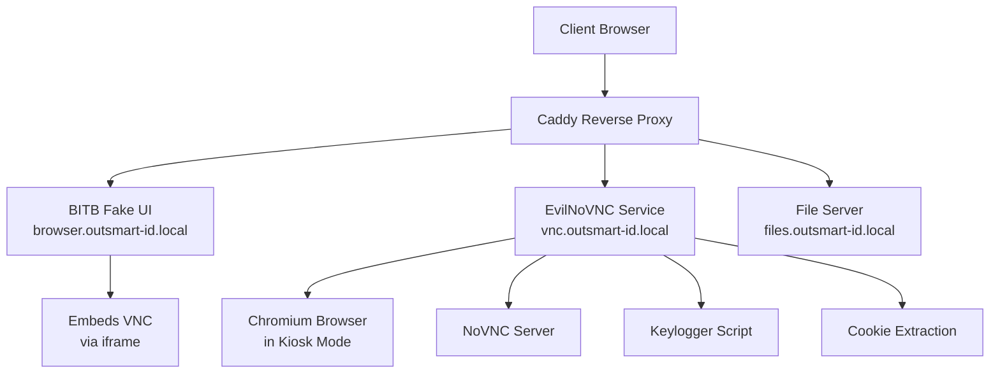
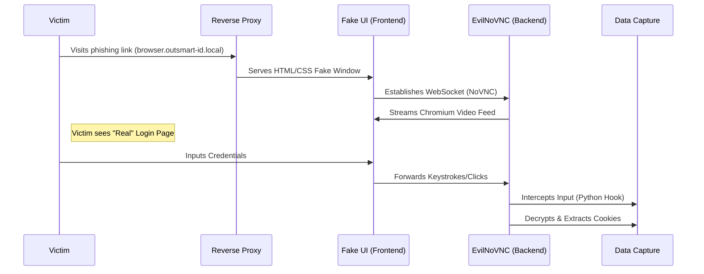

# Vulnerability Analysis: Smart-ID+ QR Device Linking Bypass via Dynamic BITB

## 1. Executive Summary

This report details a high-severity vulnerability within the **OutSmart-ID** Proof of Concept (PoC). This vector leverages a **dynamic Browser-in-the-Browser (BITB)** attack to compromise users relying on **Smart-ID+** QR codes for authentication.

Unlike static phishing pages that struggle to replicate complex multi-factor authentication (MFA) flows, this architecture employs a **containerized, virtualization-based approach**. By projecting a live, remote browser session into a fake HTML popup window, the attacker can present the **legitimate** Smart-ID login portal to the victim along with allowing valid QR codes to be shown on the phishing page to the victim.

## 2. Technical Mechanics: The "Perfect" Illusion

### 2.1 The BITB Frontend (The Container)
The attack renders a simulated popup window using high-fidelity HTML, CSS, and JavaScript within the attacker's domain (`browser.outsmart-id.local`).
*   **Visual Deception:** The "Address Bar," "SSL Lock," "Favicon," and "Window Controls" are rendered DOM elements, not OS controls. They mimic the victim’s OS (Windows/macOS) and browser (Chrome/Edge/Safari) pixel-perfectly.
*   **The Trap:** Because the window is part of the parent page's DOM, it cannot be dragged outside the browser viewport—the primary heuristic for detecting BITB.

### 2.2 The VNC Backend (The Content)
Standard MITM/phishing pages fail against Smart-ID+ because dynamic QR codes will not be generated in phishing contexts. OutSmart-ID solves this by serving the true legitimate context via a **live, interactive browser session** :
1.  **Isolation:** A Docker container runs a headless Chromium instance in **Kiosk mode**, pointing directly to the legitimate Service Provider (e.g., Internet Bank, Government Portal).
2.  **Transport:** An `EvilNoVNC` service bridges the container's display to the victim's browser via WebSockets.
3.  **Interaction:** The victim's clicks and keystrokes are forwarded to the container.

## 3. System Architecture

The attack utilizes a microservices architecture to ensure seamless proxying and data exfiltration.

### 3.1 Attack Flow

## 4. Impact Analysis & Attack Vectors

### 4.1 Authenticated Session Hijacking (The Primary Goal)
The ultimate goal is not just credential harvesting, but **session hijacking**.
*   **Mechanism:** When the user scans the Smart-ID+ QR code on their phone, the *remote* browser (in the Docker container) becomes authenticated.
*   **Exfiltration:** The attacker extracts the valid session cookies (`JSESSIONID`, `SID`, etc.) from the container.
*   **Result:** The attacker imports these cookies into their own browser, granting them full access to the victim's bank or government account without needing to trigger a secondary authentication request.

### 4.2 Bypass of Standard Indicators
*   **URL Bar:** The victim sees `https://validdomain.com` inside the fake window.
*   **Certificates:** The fake window displays a CSS-rendered SSL padlock.
*   **Content Validity:** The content is not a clone; it is the live legitimate site, rendering all dynamic content (CAPTCHAs, news feeds, control codes) correctly.

### 4.3 PII Harvesting
Even if the login fails, the system captures:
*   **National ID Numbers (Isikukood):** via Keylogger.
*   **User IP and User Agent:** via the Caddy logs.

## 5. User Awareness (The "Drag Test")
The most effective immediate defense for end-users:

> **"If you can't drag the login window off your browser and onto your desktop wallpaper, it is a fake window."**

A BITB window is rendered in HTML/CSS and is confined to the boundaries of the parent browser tab. A real popup window is a separate OS process that can move freely across monitors.

---

## 6. Disclosure Timeline

| Date | Event |
|------|-------|
| 2025-09 | Vulnerability identified during security research |
| 2025-10 | Preliminary technical analysis completed |
| 2025-11 | Responsible disclosure initiated with SK ID Solutions |
| 2025-12-05 | SK ID Solutions acknowledges vulnerability; states risk was "consciously accepted" during development |
| 2025-12 | CVE registration attempted; SK ID marks entry as **DISPUTED** |
| 2026-02 | Formal memoranda submitted to RIA, TTJA, and AKI |
| 2026-04 | Research published |

For the full disclosure timeline across all findings, see [Responsible Disclosure Timeline](../05-enforcement/responsible-disclosure-timeline.md).
